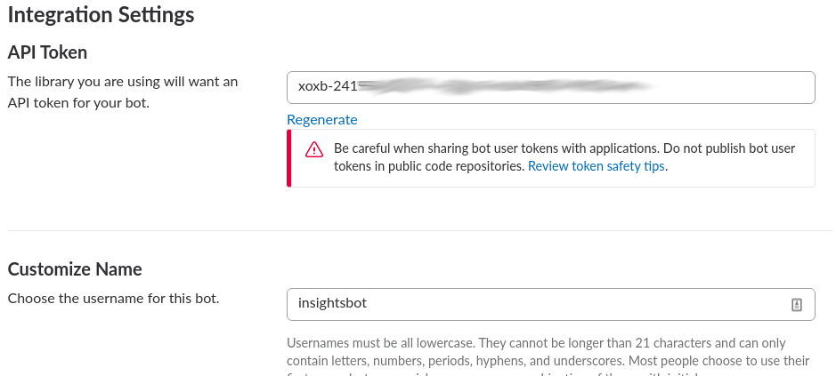
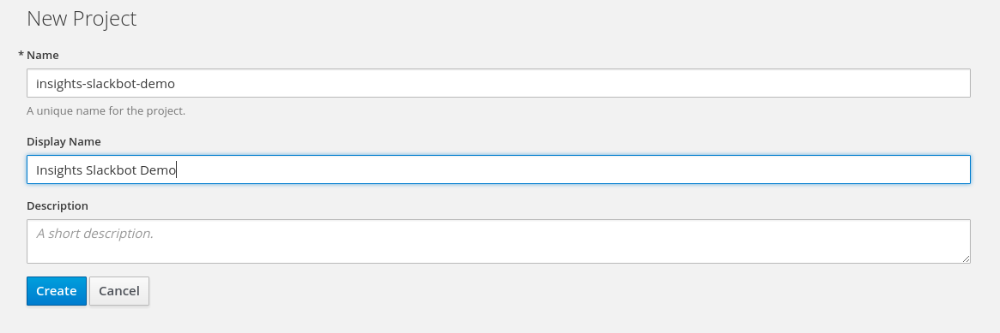
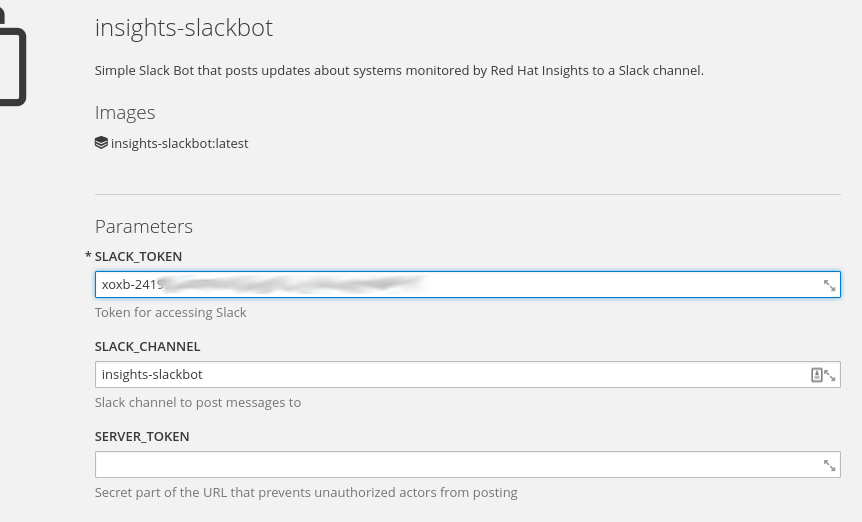
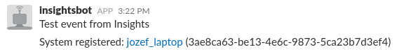

# Red Hat Insights Webhooks Tutorial

This tutorial demonstrates how Red Hat Insights can be integrated with other services using [webhooks](https://access.redhat.com/r/insights/docs/#api-Webhooks). More specifically, we will be deploying a simple service that listens to webhooks from Red Hat Insights and turns them into messages posted to a Slack channel.

## Prerequisites

To complete this tutorial you'll need:
* a [Slack team account](https://slack.com/)
* either
  * a [Red Hat OpenShift account](https://www.openshift.com/), or
  * development environment with [Docker](https://www.docker.com/)

### Getting Slack token

1. Open `https://<your-slack-team>.slack.com/apps/A0F7YS25R-bots`
1. Click **Add Configuration**
1. Pick a username for the bot (e.g. insights-slackbot)
1. Click **Add bot integration**
1. Keep the generated Slack API Token for later

    
1. (Optional) bot user can be customized, for example its description, avatar, etc.
1. Back in your Slack team default view choose a channel you want the bot to post updates to and invite the bot to join this channel

### Running the bot

[insights-slackbot](https://github.com/redhatinsights/insights-slackbot) is a thin layer that translates events received from Red Hat Insights over webhooks and translates them into messages posted into a Slack channel.

It needs to be run and reachable from the Internet over HTTPS for the integration to work. There are multiple ways to achieve this:

#### Option A: Running insights-slackbot in Red Hat OpenShift

[Red Hat OpenShift](https://www.openshift.com/) is a container platform by Red Hat that provides environment for deploying and managing containers based on Docker.
If you do not have an account yet a [Started Plan](https://www.openshift.com/pricing/index.html) can be used for free.

In your OpenShift Web Console:
1. Create a new project by clicking "New Project" button in upper right corner
1. Fill in project name and "Display Name"

    
1. Choose **Import YAML / JSON** tab
1. Use [this template](../openshift-template.yaml). The template will create a new deployment and set up a route for it to be available from the Internet. Proceed further by clicking the **Create** button.
1. Make sure **Process the template** is checked and click **Continue**
1. Fill in your Slack token and the name of the Slack channel you had invited the bot into

    
1. (Optional) Fill in a secret server token that will protect the webhook receiver from being called by unauthorized actors
1. Click **Application** --> **Routes**, locate the generated URL of the webhook endpoint (Hostname column) and keep it for the next step

#### Option B: Running insights-slackbot locally

An alternative option is to run insights-slackbot locally and use [ngrok](https://ngrok.com/) to tunnel webhook calls from Insights to the local instance.

1. Open https://ngrok.com/download and download ngrok for your platform
1. Unzip the package
1. Pull the latest docker image of insights-slackbot
    ```
    docker pull redhatinsights/insights-slackbot
    ```
1. Run insights-slackbot
    ```
    docker run --name insights-slackbot -p 3006:3006 -e SLACK_TOKEN=<your slack bot api token> -e SLACK_CHANNEL=<slack channel you had invited the bot into> redhatinsights/insights-slackbot:latest
    ```
1. Run ngrock to tunnel webhook calls to the running container
    ```
    ./ngrok http 3006
    ```
1. ngrok generates a unique URL that serves as the entry point for the tunnel. Locate the line that looks like
    ```
    Forwarding                    https://8132d156.ngrok.io -> localhost:3006
    ```
    Locate the URL and keep it for the next step.

### Setting up Webhook in Insights

1. Open to https://access.redhat.com/insightsbeta/config/webhooks
1. Click **ADD WEBHOOK**
1. Enter the insights-slackbot URL obtained in the previous step. Make sure the URL uses `https`.
1. Click **SAVE**
1. Press the **TEST EVENT** button. A test message should appear in the slack channel you specified. Updates to your systems monitored by Red Hat Insights (e.g. new system registered, new issue identified, ...) will be posted to the Slack channel from now on.

    
